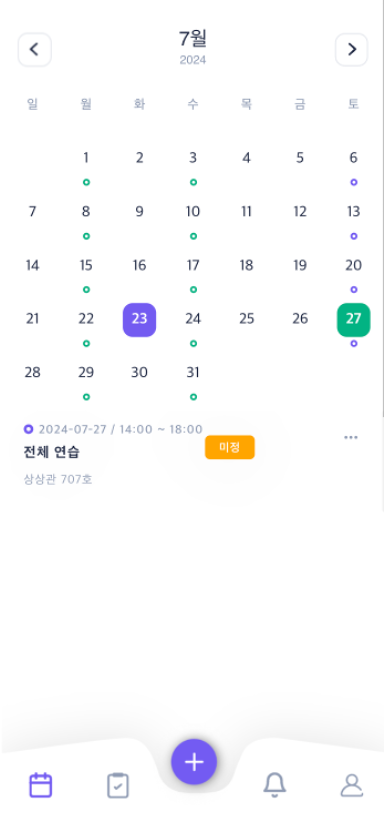
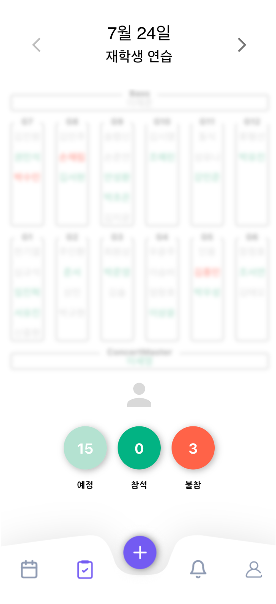

# attendSystem

## 프로젝트 소개
`attendSystem`은 사용자가 손쉽게 출석체크를 관리할 수 있는 웹 기반 애플리케이션입니다. 구글과 카카오 소셜 로그인을 지원하며, 달력을 통한 일정 관리와 출석 기록의 편리한 조회가 가능합니다.
해당 앱은 관리자 입장에서 파트별 출석 현황을 한눈에 볼 수 있도록 만드는데 초점이 맞춰져 있습니다.

## 주요 기능
- **소셜 로그인**: 구글과 카카오 계정을 통해 로그인
- **달력 조회**: 등록된 일정을 달력으로 확인
- **일정 및 출석 예정 등록**: 중요 일정 등록 및 출석 예정일을 등록
- **출석 조회**: 해당 일정에 출석 예정을 등록한 멤버 확인
- **출석 체크**: 해당 일정에 특정 시간대에 출석을 체크 ( 시간이 지날경우 출석체크 불가능)

## 기술 스택
- **프론트엔드**: React, TypeScript, MUI, HTML, CSS
- **백엔드**: Node.js
- **DB**: MongoDB
- **디자인**: Figma
- **배포**: Vercel, 카페24
- **소셜 로그인**: Firebase (Google), Kakao
- **AI 서포트**: Chat GPT 4

  

